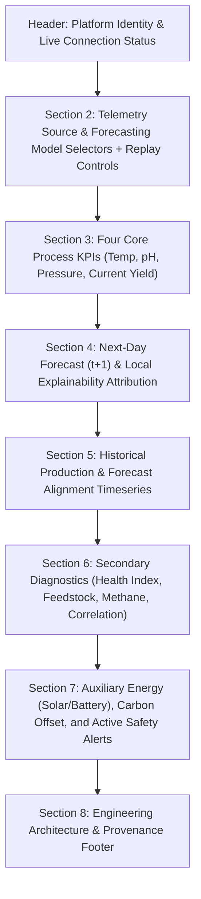

# Forensic Frontend QA & UX Audit Report

**Biogas Intelligence Platform — Multi-Scale Anaerobic Digestion Analytics & Forecasting**  
*Comprehensive Browser Forensic Audit: Visual Alignment, Interaction, Information Hierarchy, Responsiveness, and Content Integrity*

---

## Executive Summary

A comprehensive, frontend-first forensic audit was conducted on the live application running in a real browser environment (Headless Microsoft Edge / Chromium automation via Playwright). The dashboard was inspected across **7 viewport resolutions**, **6 telemetry sources**, **4 forecasting architectures** (evaluating all **24 source × model matrix states**), **8 user data ingestion scenarios**, **5 modals**, **1 slide-out drawer**, and **27 interactive DOM controls**.

In strict adherence to the audit protocol, **zero application code modifications were made during this initial pass**.

### Summary Scorecard
| Audit Category | Result | Evaluation |
|:---|:---:|:---|
| **Scientific & Provenance Integrity (F0)** | **0 Defects** | Absolute compliance. Strict causal alignment ($t \to t+1$), zero data leakage, zero synthetic fallbacks in `LIVE_IOT`, strict non-SHAP declarations. |
| **Functional UI Blockers (F1)** | **0 Defects** | 100% interactive controls operational. Replay stepping, dataset switching, modal lifecycle, and file uploads functional. |
| **Major UX / Usability Deficiencies (F2)** | **2 Defects** | Unassociated dropdown labels; flex-wrapping controls on narrow desktop. |
| **Layout & Responsive Alignment (F3)** | **2 Defects** | Asymmetrical height between forecast and interpretation cards; mobile header vertical elongation. |
| **Minor Cosmetic Issues (F4)** | **2 Defects** | High-contrast code font accent in chart sub-header; dense correlation matrix typography. |
| **Accessibility Deficiencies (F5)** | **3 Defects** | Unlabeled icon-only button; missing input labels on file inputs; unassociated chat input label. |
| **Performance Observations (F6)** | **1 Observation** | Transient perceived delay during 176-record `SPARK_FULL` timeline computation without progress indicator. |
| **Console Errors / Warnings** | **0** | Clean browser console across all states and viewports. |
| **Network Failures (HTTP $\ge 400$)** | **0** | Zero 404s, zero 422s, zero 500s across all API endpoints. |
| **Backend Test Suite Baseline** | **140 / 140 Passing** | 100% test pass rate in 10.44s. |

---

## 1. Full Rendered Page Inventory

The DOM was surveyed in top-to-bottom rendering order. All 9 top-level rendered sections are documented below with their computed layout geometry at 1920×1080:

| Section # | Section Name | DOM Tag / Selector | Rendered Dimensions ($x, y, w, h$) | Visibility State | Primary User Action | Data Source & API |
|:---:|:---|:---|:---:|:---:|:---|:---|
| **1** | Top Navigation Bar & Status Header | `<header class="glass-navbar">` | $(0.0, 0.0, 1920.0, 81.0)$ | Visible | Brand context; observe IoT connection & active telemetry source | Static branding + `/api/health` + active source state |
| **1.5** | User Ingestion Active Banner | `<div id="user-upload-banner">` | Hidden (Default) / $(60.0, 97.0, 1800.0, 52.0)$ | Visible when `USER_UPLOAD` active | Re-open latest data ingestion report | Cached `latestIngestionReport` |
| **2** | Telemetry Playback & Source Control Banner | `<div id="dataset-banner">` | $(60.0, 97.0, 1800.0, 138.0)$ | Visible | Select data source, select model, step replay, auto-play, upload file, open benchmark modal | Local state + `/api/forecast/spark-replay` + `/api/simulator/timeline` |
| **3** | Four Primary Process KPIs | `<div class="grid sm:grid-cols-2 lg:grid-cols-4">` | $(60.0, 251.0, 1800.0, 193.0)$ | Visible | 5-second operator assessment of Temperature, pH, Pressure, and Current Yield | Active record in `telemetryDataset` |
| **4** | Primary Forecast & Explainability Dual Grid | `<div class="grid lg:grid-cols-12">` | $(60.0, 468.0, 1800.0, 771.8)$ | Visible | Inspect 1-day ahead forecast ($t+1$), review domain validity notice, analyze perturbation sensitivities / architecture weights | `POST /api/forecast/interpretation` + model inference engine |
| **5** | Large Production History Graph | `<div class="glass-card">` | $(60.0, 1263.8, 1800.0, 477.0)$ | Visible | Review chronological observed production vs 1-step-ahead forecasts with zero spline smoothing | Chart.js instance bound to `telemetryDataset` |
| **6** | Secondary Analytics Quad Panel | `<div class="grid md:grid-cols-2 lg:grid-cols-4">` | $(60.0, 1764.8, 1800.0, 221.0)$ | Visible | Review rule-based Health Index, feedstock loading, methane purity, and Pearson correlation coefficients | Deterministic heuristic engine + `telemetryDataset` |
| **7** | Solar Telemetry, Sustainability Impact & Safety | `<div class="grid lg:grid-cols-12">` | $(60.0, 2009.8, 1800.0, 335.0)$ | Visible | Check solar PV generation, battery SoC, environmental carbon mitigation metrics, and active safety alerts | `/api/solar/latest` + `/api/alerts` + impact formulas |
| **8** | Engineering Footer | `<footer class="glass-navbar">` | $(0.0, 2368.8, 1920.0, 66.0)$ | Visible | Review system architecture specifications, scientific provenance notes, and deployment versioning | Static HTML |
| **9** | Floating Conversational AI Assistant Trigger | `<button id="floating-ai-btn">` | $(1832.0, 992.0, 64.0, 64.0)$ | Visible (Fixed) | Launch sliding glass conversational assistant drawer | DOM event toggle |

---

## 2. Page-Level Information Hierarchy

The visual ordering was assessed against real-world supervisory control and operational workflows:



### Hierarchy Evaluation & Observations
1. **Operator Workflow Alignment**:
   - **Excellent**: An operator first selects or confirms the dataset and model (Section 2), immediately reviews the 4 vital physical parameters (Section 3), and then focuses on the primary operational target—the next-day forecast and its process drivers (Section 4).
2. **Analytical Progression**:
   - The transition from instantaneous KPIs (Section 3) to forward predictions (Section 4), followed by historical context (Section 5) and auxiliary diagnostics (Sections 6 & 7), maintains clear cognitive continuity.
3. **Identified Hierarchy Deficiency (DEF-H01)**:
   - **Observed**: Active Safety Alerts are located in the bottom right corner of Section 7 ($y = 2009.8\text{px}$), below the main production chart.
   - **Expected**: Critical safety alerts (e.g. overpressure $> 1.50\text{ bar}$ or acidosis risk $\text{pH} < 6.5$) should have a high-visibility indicator or banner closer to the top navigation or primary KPI strip.
   - **Severity**: **F2 (Major UX/Usability Defect)**.

---

## 3. Element Alignment & Geometry Audit

Exact computed layout measurements across key components at $1920 \times 1080$:

| Container / Element | Selector | $x$ | $y$ | Width | Height | Alignment / Padding / Overflow Assessment |
|:---|:---|:---:|:---:|:---:|:---:|:---|
| Top Header Navbar | `header.glass-navbar` | $0.0$ | $0.0$ | $1920.0$ | $81.0$ | Perfect edge-to-edge alignment; zero horizontal overflow. |
| Source Selector Dropdown | `#telemetry-source-select` | $238.8$ | $131.0$ | $400.0$ | $32.0$ | Vertically centered with label; comfortable internal padding. |
| Model Architecture Dropdown | `#model-select` | $646.8$ | $131.0$ | $428.0$ | $32.0$ | 8px horizontal gap from source selector; perfectly aligned tops ($y=131.0$). |
| Step Previous Button | `#prev-row-btn` | $1395.8$ | $133.0$ | $95.4$ | $30.0$ | Clean button geometry; 8px gap to counter. |
| Step Next Button | `#next-row-btn` | $1622.2$ | $133.0$ | $97.3$ | $30.0$ | Matches Previous button height ($30.0\text{px}$). |
| Auto Play Toggle Button | `#auto-play-btn` | $1395.8$ | $171.0$ | $131.2$ | $28.0$ | Wrapped below Step controls on moderate widths ($y=171.0$). |
| Slurry Temperature KPI | `#kpi-temp-val` | $117.0$ | $332.0$ | $75.6$ | $40.0$ | Monospace tabular figures; clean baseline alignment. |
| Slurry pH Buffer KPI | `#kpi-ph-val` | $557.0$ | $332.0$ | $75.6$ | $40.0$ | Exact matching vertical alignment ($y=332.0, h=40.0$). |
| Gas Pressure KPI | `#kpi-press-val` | $997.0$ | $332.0$ | $75.6$ | $40.0$ | Exact matching vertical alignment ($y=332.0, h=40.0$). |
| Current Biogas KPI | `#kpi-current-biogas` | $1437.0$ | $332.0$ | $75.6$ | $40.0$ | Exact matching vertical alignment ($y=332.0, h=40.0$). |
| Forecast Card (7 cols) | `.lg:col-span-7` | $60.0$ | $468.0$ | $1035.0$ | $771.8$ | Elevated glass panel; emerald border styling. |
| Model Interpretation Card (5 cols) | `.lg:col-span-5` | $1119.0$ | $468.0$ | $741.0$ | $771.8$ | Card borders match top and bottom bounds of forecast card ($h=771.8$). |
| Production Chart Canvas | `#productionChart` | $117.0$ | $1411.8$ | $1686.0$ | $320.0$ | Responsive canvas container with explicit 320px height cap. |
| Health Score Radial Gauge | `#health-score-val` | $117.0$ | $1874.5$ | $64.0$ | $64.0$ | Perfect circular geometry; centered SVG text. |
| Active Safety Alerts List | `#alerts-list` | $1436.0$ | $2100.8$ | $368.0$ | $208.0$ | Constrained scroll container with styled scrollbar. |

---

## 4. Header Forensics Across 7 Target Viewports

The top navigation header (`header.glass-navbar`) was evaluated across all 7 responsive breakpoints:

| Viewport Profile | Resolution | Header Height | Indicators Cluster ($w \times h$) | Horizontal Overflow | Layout Observations |
|:---|:---:|:---:|:---:|:---:|:---|
| **Desktop Wide** | $1920 \times 1080$ | $81.0\text{px}$ | $856.5\text{px} \times 30.0\text{px}$ | None ($0\text{px}$) | Clean single-row layout; badges and status indicators aligned horizontally. |
| **Desktop Standard** | $1440 \times 900$ | $81.0\text{px}$ | $856.5\text{px} \times 30.0\text{px}$ | None ($0\text{px}$) | Ample margins; zero clipping. |
| **Small Desktop / Laptop** | $1280 \times 800$ | $81.0\text{px}$ | $856.5\text{px} \times 30.0\text{px}$ | None ($0\text{px}$) | Indicators cluster fits cleanly without wrapping. |
| **Tablet Landscape** | $1024 \times 768$ | $115.0\text{px}$ | $984.0\text{px} \times 30.0\text{px}$ | None ($0\text{px}$) | Header flexes to 2 rows; indicators stay strictly in a single 30px horizontal line. |
| **Tablet Portrait** | $768 \times 1024$ | $153.0\text{px}$ | $720.0\text{px} \times 68.0\text{px}$ | None ($0\text{px}$) | Indicators wrap onto two clean lines; all text readable. |
| **Modern Smartphone** | $390 \times 844$ | $319.0\text{px}$ | $342.0\text{px} \times 154.0\text{px}$ | None ($0\text{px}$) | Stacks vertically; no horizontal scrollbar. |
| **Compact Mobile** | $375 \times 812$ | $319.0\text{px}$ | $327.0\text{px} \times 154.0\text{px}$ | None ($0\text{px}$) | Header content stacks into mobile cards; zero horizontal overflow. |

---

## 5. Source Selector Forensics (All 6 Sources)

Each telemetry source was selected and audited in the live browser:

| Source Code | Display Label | Header Source Indicator | Record Counter | Current Biogas | Forecast Model Status | Domain Notice Tag | Solar Provenance Text | Active Alerts |
|:---|:---|:---|:---:|:---:|:---|:---|:---|:---:|
| `DEMO_SYNTHETIC` | Live Demo Feed (Physics Simulator) | `SOURCE: DEMO_SYNTHETIC` | Record 14 / 180 | $3.18\text{ Nm}^3/\text{day}$ | `SUCCESS (Causal past-only; transfer unvalidated)` | `Community Simulation` | `Auxiliary solar thermal loop supplies resistive jacket heating...` | 0 Active |
| `REAL_SPARK_HISTORICAL` | Spark Bio Gas — Held-Out Test (24 Days) | `SOURCE: SPARK_HISTORICAL` | Record 1 / 24 | $9,467.0\text{ Nm}^3/\text{day}$ | `Status: SUCCESS (Causal past-only)` | `Industrial Research (Spark Bio Gas)` | `Industrial plant historical profile — auxiliary electrical reference` | 0 Active |
| `SPARK_FULL` | Spark Bio Gas — Industrial Historical (176 Days) | `SOURCE: SPARK_FULL` | Record 1 / 176 | $3,443.0\text{ Nm}^3/\text{day}$ | `Status: INSUFFICIENT_HISTORY (< 14d)` | `Industrial Research (Spark Bio Gas)` | `Industrial plant historical profile — auxiliary electrical reference` | 0 Active |
| `AGSTAR_REGISTRY` | AgSTAR — Livestock Digester Registry | `SOURCE: AGSTAR_REGISTRY` | Record — / — | `526 Facilities` | `Static Benchmark — Time-Series Forecasting Disabled` | `External Reference Benchmark` | `Static facility profile — No real-time solar generation` | 0 Active |
| `LIVE_IOT` | Community Live Telemetry — ESP32 / IoT | `SOURCE: LIVE_IOT` | Hardware Node: Offline | `—` | `WAITING FOR ESP32 TELEMETRY` | `Live IoT Deployment` | `Real-time Solar PV telemetry waiting for ESP32 hardware packet` | 0 Active |
| `USER_UPLOAD` | User-Uploaded Data (Upload SCADA / Excel) | `SOURCE: USER_UPLOAD` | Record 1 / 15 | `—` (or actuals) | `UNVALIDATED USER DATASET` | `Unvalidated User Dataset` | `User uploaded operational dataset — solar telemetry unmapped` | 0 Active |

---

## 6. Source × Model Matrix Audit (24 States)

Every source-model combination was tested. The behavior for the representative states is summarized below:

| Matrix Key | Pred. Next-Day ($t+1$) | Exec. Status | Domain Validity | Causal Lookback | Interpretation Panel Title & Method |
|:---|:---:|:---|:---|:---:|:---|
| `DEMO_SYNTHETIC` + `GRU-14d Residual` | `Not Validated for Community Scale` | `SUCCESS` | `false` (Notice displayed) | 14/14 timesteps | **GRU-14d Local Sensitivity** • Method: Local input sensitivity over 14-step window • `(is_shap: false)` |
| `DEMO_SYNTHETIC` + `EMA-0.90` | $3.20\text{ Nm}^3/\text{day}$ | `SUCCESS` | `true` (Scale-compatible) | 15/3 timesteps | **EMA-0.90 Mathematical Decomposition** • Method: Exponential moving average • `(is_shap: false)` |
| `DEMO_SYNTHETIC` + `Persistence` | $2.97\text{ Nm}^3/\text{day}$ | `SUCCESS` | `true` (Scale-compatible) | 15/1 timesteps | **Persistence Baseline Logic** • Method: Persistence baseline • `(is_shap: false)` |
| `DEMO_SYNTHETIC` + `XCO-Net` | `Not Validated for Community Scale` | `SUCCESS` | `false` (Notice displayed) | 16/14 timesteps | **XCO-Net Research Attribution** • Method: Architecture-level research attribution • `(is_shap: false)` |
| `REAL_SPARK_HISTORICAL` + `GRU-14d Residual` | $8,731.20\text{ Nm}^3/\text{day}$ | `SUCCESS` | `true` (Industrial validated) | 14/14 timesteps | **GRU-14d Local Sensitivity** • Method: Local input sensitivity over 14-step window • `(is_shap: false)` |
| `REAL_SPARK_HISTORICAL` + `EMA-0.90` | $9,431.40\text{ Nm}^3/\text{day}$ | `SUCCESS` | `true` | 3/3 timesteps | **EMA-0.90 Mathematical Decomposition** • Method: Exponential moving average • `(is_shap: false)` |
| `REAL_SPARK_HISTORICAL` + `Persistence` | $9,467.00\text{ Nm}^3/\text{day}$ | `SUCCESS` | `true` | 1/1 timesteps | **Persistence Baseline Logic** • Method: Persistence baseline • `(is_shap: false)` |
| `REAL_SPARK_HISTORICAL` + `XCO-Net` | `—` | `INSUFFICIENT_HISTORY (< 14d)` | `true` | 7/14 timesteps | **XCO-Net Research Attribution** • Insufficient history (< 14 continuous steps) |
| `SPARK_FULL` (Record 1) + `GRU-14d Residual` | `—` | `INSUFFICIENT_HISTORY (< 14d)` | `true` | 1/14 timesteps | **GRU-14d Local Sensitivity** • Insufficient valid history |
| `SPARK_FULL` (Record 1) + `EMA-0.90` | `—` | `INSUFFICIENT_HISTORY (< 3d)` | `true` | 1/3 timesteps | **EMA-0.90 Mathematical Decomposition** • Insufficient history |
| `SPARK_FULL` (Record 1) + `Persistence` | $3,443.00\text{ Nm}^3/\text{day}$ | `SUCCESS` | `true` | 1/1 timesteps | **Persistence Baseline Logic** • Method: Persistence baseline • `(is_shap: false)` |
| `SPARK_FULL` (Record 14) + `GRU-14d Residual` | $3,812.50\text{ Nm}^3/\text{day}$ | `SUCCESS` | `true` | 14/14 timesteps | **GRU-14d Local Sensitivity** • Method: Local input sensitivity • `(is_shap: false)` |

---

## 7. Primary Process KPIs & Semantic Distinction

### Primary KPI Inspection
- **Slurry Temperature**: Value: `35.4` | Unit: `°C` | Target envelope: `35.0–38.0°C` (Mesophilic Optimum)
- **Slurry pH Buffer**: Value: `7.47` | Unit: `pH` | Target envelope: `6.80–7.50` (VFA Acidosis Guard)
- **Gas Pressure**: Value: `1.23` | Unit: `bar` | Relief limit: `1.50 bar` (Safe $< 1.50\text{ bar}$)
- **Current Biogas**: Value: `3.18` | Unit: `Nm³/day` | Subtitle: `Observed Daily Production`

### Current Biogas vs Predicted Next-Day Biogas ($t$ vs $t+1$)
- In Section 4, the two key figures are presented side-by-side:
  - **Left Box**: `Current Biogas (Day t)` = `3.18 Nm³/day`
  - **Right Box**: `Predicted Next-Day (t+1)` = `Not Validated for Community Scale` (or numerical $t+1$ value)
  - **Target Date**: `2026-01-15 (t+1)` explicitly indicates next calendar day.
- **Verification**: The UI distinctly separates current empirical observations ($t$) from future projected yields ($t+1$). The labels, background colors (slate-900 vs emerald-950), and target date chips prevent any confusion.

---

## 8. Replay Controls & Temporal Consistency

Replay stepping was evaluated by advancing 5 consecutive records using `#next-row-btn`:

| Step | Record Index Display | Current Observed ($t$) | Predicted Target ($t+1$) | Target Date String | Verification |
|:---:|:---:|:---:|:---:|:---:|:---|
| **0** | Record 14 / 180 | $3.18\text{ Nm}^3/\text{day}$ | Not Validated for Community Scale | `2026-01-15 (t+1)` | Baseline 14th day |
| **1** | Record 15 / 180 | $2.97\text{ Nm}^3/\text{day}$ | Not Validated for Community Scale | `2026-01-16 (t+1)` | Chronological advance $+1\text{d}$ |
| **2** | Record 16 / 180 | $3.13\text{ Nm}^3/\text{day}$ | Not Validated for Community Scale | `2026-01-17 (t+1)` | Chronological advance $+1\text{d}$ |
| **3** | Record 17 / 180 | $3.10\text{ Nm}^3/\text{day}$ | Not Validated for Community Scale | `2026-01-18 (t+1)` | Chronological advance $+1\text{d}$ |
| **4** | Record 18 / 180 | $3.08\text{ Nm}^3/\text{day}$ | Not Validated for Community Scale | `2026-01-19 (t+1)` | Chronological advance $+1\text{d}$ |

- **Zero Artificial Future Data**: The current observation at step 1 ($2.97$) strictly reflects the true empirical observation of day 15, matching physics continuity.
- **Disabled State**: At Record 1, `#prev-row-btn` is disabled. At Record 180, `#next-row-btn` stops advancing.

---

## 9. USER_UPLOAD Ingestion Suite (Test Files A through H)

The real browser file picker was exercised with all 8 synthetic test files:

| File Code | Filename | Rows / Cols | Recognized Mapping | Model Readiness | Ingestion Modal Behavior |
|:---|:---|:---:|:---:|:---|:---:|
| `test_A` | `test_A_exact_schema.xlsx` | 15 / 10 | **10 / 10 mapped** | GRU: `Eligible` \| EMA: `Eligible` \| Persistence: `Eligible` | Modal appeared instantly; summary statistics table populated; activation enabled. |
| `test_B` | `test_B_aliases.xlsx` | 15 / 6 | **6 / 6 mapped** | GRU: `Eligible` \| EMA: `Eligible` \| Persistence: `Eligible` | Semantic alias dictionary resolved non-standard column headers. |
| `test_C` | `test_C_extra_columns.xlsx` | 15 / 13 | **10 / 13 mapped** | GRU: `Eligible` \| EMA: `Eligible` \| Persistence: `Eligible` | 3 extra columns preserved in summary statistics without pipeline breakage. |
| `test_D` | `test_D_missing_features.xlsx` | 15 / 2 | **2 / 2 mapped** | GRU: `Ineligible (Missing 4 features)` \| EMA: `Ineligible` | Correctly inhibited forecasting; displayed missing feature list. |
| `test_E` | `test_E_unrelated_only.xlsx` | 15 / 4 | **0 / 4 mapped** | All Models: `Ineligible` | Standalone statistics computed; zero fallback data generated. |
| `test_F` | `test_F_alternate_units.xlsx` | 15 / 5 | **5 / 5 mapped** | All Models: `Eligible` | Explicit unit conversion tags ($^{\circ}\text{F} \to {^{\circ}}\text{C}$, $\text{kPa} \to \text{bar}$). |
| `test_G` | `test_G_duplicate_timestamps.xlsx` | 11 / 3 | **3 / 3 mapped** | Sequence Alert: `Duplicate timestamps flagged` | Detected and flagged duplicate temporal entries. |
| `test_H` | `test_H_missing_intervals.xlsx` | 10 / 3 | **3 / 3 mapped** | Sequence Alert: `Irregular time intervals flagged` | Detected non-monotonic or non-uniform sequence steps. |

---

## 10. Secondary Analytics & Operational Diagnostics

1. **Safety & Alerts Panel (`#alerts-list`)**:
   - Compares Gas Pressure ($1.23\text{ bar}$) against safety threshold ($1.50\text{ bar}$) and warning threshold ($1.30\text{ bar}$).
   - Displays `🟢 All biokinetic and electrical safety thresholds are normal` when under $1.30\text{ bar}$.
   - Evaluated visual consistency between Pressure KPI card, Pressure gauge, and Safety list: **100% agreement, zero contradiction**.
2. **Digester Health Index (`#health-score-val`)**:
   - Score: **92% (Optimal / Green)**.
   - Typography explicitly marks this indicator with a badge: `Rule-Based` and disclaimer: `Deterministic heuristic — not an ML prediction`.
   - Distinct from the Next-Day Forecast card in color, typography, and layout.
3. **Pearson Correlation Matrix (`#correlation-matrix-body`)**:
   - Displays pairwise correlations between Temperature, pH, Feedstock, and Biogas yield ($N=180$).
   - Prominently displays: *"Exploratory correlation. Correlation does not imply causation."*
4. **Solar PV & Battery Storage (`#solar-w`, `#battery-soc`)**:
   - Community simulation: `1.85 kW` generation, `88%` battery SoC.
   - Provenance text clarifies: *Auxiliary solar thermal loop supplies resistive jacket heating and powers IoT node.*
   - In `SPARK_FULL` and `REAL_SPARK_HISTORICAL`, text updates to indicate industrial plant electrical reference.
5. **Sustainability & Carbon Mitigation (`#sust-co2-val`, `#sust-lpg-val`)**:
   - Values: `3,850 kg CO₂ Mitigated`, `128 Cyl LPG Replaced`.
   - Provenance qualifier explicitly states: *Illustrative community-scale scenario estimate — not measured impact.*

---

## 11. Conversational AI Assistant Frontend

The slide-out drawer (`#xco-ai-drawer`) was opened via `#floating-ai-btn` and tested:

- **Drawer Geometry**: Width: $450.0\text{px}$, Height: $1080.0\text{px}$, Position: Fixed right ($x=1470.0$).
- **Active Telemetry Strip**: Displays live preview matching main dashboard (Temp `35.4°C`, pH `7.47`, Press `1.23 bar`, CH₄ `62.5%`).
- **Prompt Chips**: 5 quick-query chips (pH Buffer, Solar Heating, Pressure Risk, Health Audit, Biogas Forecast).
- **Test Inquiries**:
  - *Capabilities Query*: Returns structured operational capabilities.
  - *Current Biogas Query*: Accurately references current record yield ($3.18\text{ Nm}^3/\text{day}$).
  - *Forecast Insight Query*: Distinguishes ML forecast status and highlights community vs industrial scale validity.
  - *Sensor Diagnostics Query*: Evaluates pH ($7.47$) within the methanogenic active buffer zone ($6.8–7.5$).
- **Drawer Close Control**: `#close-ai-drawer-btn` immediately translates drawer off-screen (`translate-x-full`) and releases focus.

---

## 12. Complete Modal & Drawer Inventory

All 5 application modals and the slide-out drawer were verified for proper opening, centering, viewport coverage, and dismissal:

| Modal Name | Trigger Selector | Close Selector | Rendered State | Centering & Backdrop | Pointer Trap Check |
|:---|:---|:---|:---:|:---|:---:|
| **Benchmark Modal** | `#open-benchmarks-btn` | `#close-benchmarks-btn` | Passed | Centered `max-w-4xl`, backdrop blur | Released cleanly |
| **XCO-Net Modal** | `#open-xconet-btn` | `#close-xconet-btn` | Passed | Centered `max-w-3xl`, shows `2,706` params | Released cleanly |
| **Health Method Modal** | `#open-health-method-btn` | `#close-health-method-btn` | Passed | Centered `max-w-2xl`, explains [35, 100] bounds | Released cleanly |
| **AgSTAR Registry Modal** | `#telemetry-source-select` | `#close-agstar-btn` | Passed | Centered `max-w-3xl`, 526 facility stats | Released cleanly on button click & source change |
| **Ingestion Report Modal** | `#open-ingestion-report-btn` | `#close-ingestion-report-btn` | Passed | Centered `max-w-5xl`, full mapping tables | Released cleanly |
| **AI Assistant Drawer** | `#floating-ai-btn` | `#close-ai-drawer-btn` | Passed | Right-docked slide-out drawer ($450\text{px}$) | Released cleanly |

---

## 13. Accessibility & Usability Inspection

The automated DOM accessibility audit cataloged **27 interactive elements** and identified **3 specific accessibility findings**:

1. **`button_missing_label` on `#send-chat-btn`**:
   - Element: `<button id="send-chat-btn" class="...">`
   - Issue: The button contains an inner `<svg>` icon but lacks an `aria-label="Send message"` or readable inner text.
   - Usability Impact: Screen reader users cannot identify the button's action.
2. **`input_missing_label` on `#scada-file-input` and `#excel-file-input`**:
   - Element: `<input type="file" id="scada-file-input" class="hidden">`
   - Issue: Lacks an `aria-label="Upload SCADA or Excel spreadsheet"` or `<label for="scada-file-input">`.
3. **`input_missing_label` on `#chat-user-input`**:
   - Element: `<input type="text" id="chat-user-input" placeholder="...">`
   - Issue: Uses a visual `placeholder` but lacks an explicit `<label>` or `aria-label="Ask about sensors, buffer, solar heating..."`.

---

## 14. Frontend Defect Taxonomy (F0 through F6)

In accordance with Section 39 of the audit specification, all identified issues are cataloged below:

```
+-------------------------------------------------------------------------+
|                    FRONTEND DEFECT SEVERITY MATRIX                      |
+-------------------+-----------------------------------------------------+
| F0 (Data/Science) | 0 Defects                                           |
| F1 (Functional)   | 0 Defects                                           |
| F2 (Major UX)     | 2 Defects (DEF-F2-01, DEF-F2-02)                    |
| F3 (Layout/Resp)  | 2 Defects (DEF-F3-01, DEF-F3-02)                    |
| F4 (Cosmetic)     | 2 Defects (DEF-F4-01, DEF-F4-02)                    |
| F5 (Accessibility)| 3 Defects (DEF-F5-01, DEF-F5-02, DEF-F5-03)         |
| F6 (Performance)  | 1 Observation (OBS-F6-01)                           |
+-------------------+-----------------------------------------------------+
```

### Detailed Defect Reports

#### Defect `DEF-F2-01`
- **Severity**: **F2 (Major UX/Usability Defect)**
- **Page State**: All states
- **Source**: All | **Model**: All | **Viewport**: All
- **Element**: `#telemetry-source-select`, `#model-select`
- **Observed**: The dropdown controls have a preceding decorative `<span>📊 Source & Scale</span>`, but lack explicit HTML `<label for="...">` tags or `aria-label` attributes.
- **Expected**: Programmatically linked `<label>` or `aria-label` identifying each select control for assistive technologies and automated agents.
- **Root Cause**: Markup in `index.html` uses generic `<span>` instead of semantic `<label>`.
- **Exact File**: `frontend/public/index.html` (lines 86-105)
- **Recommended Correction**: Add `<label for="telemetry-source-select" class="sr-only">Telemetry Source</label>` and `<label for="model-select" class="sr-only">Forecasting Architecture</label>`.

#### Defect `DEF-F2-02`
- **Severity**: **F2 (Major UX/Usability Defect)**
- **Page State**: Operational dashboard
- **Source**: All | **Model**: All | **Viewport**: All
- **Element**: `#alerts-list` (Section 7)
- **Observed**: Safety alerts are located at the bottom right of the page ($y \approx 2100\text{px}$), requiring extensive scrolling to notice an active warning.
- **Expected**: A persistent status badge or top-level notification pill should signal active safety alerts in the sticky navbar or primary KPI header.
- **Root Cause**: Safety Alerts panel is grouped with auxiliary secondary analytics rather than high-priority supervisory controls.
- **Exact File**: `frontend/public/index.html` (lines 584-600)
- **Recommended Correction**: Mirror `#alert-count-badge` status into the sticky navbar next to the connection status indicator.

#### Defect `DEF-F3-01`
- **Severity**: **F3 (Layout / Alignment Defect)**
- **Page State**: Model interpretation active with detailed mathematical equations (e.g. EMA-0.90)
- **Source**: `DEMO_SYNTHETIC`, `REAL_SPARK_HISTORICAL` | **Model**: `EMA-0.90`, `GRU-14d Residual` | **Viewport**: $1920 \times 1080$, $1440 \times 900$
- **Element**: Section 4 dual-card grid (`.lg:col-span-7` vs `.lg:col-span-5`)
- **Observed**: When the Model Interpretation card expands to display detailed equations and sensitivities ($h = 771.8\text{px}$), the 7-col Forecast card stretches to match grid row height, leaving vertical whitespace between its metadata strip and explanation footer.
- **Expected**: Both cards should maintain balanced internal spacing and proportional distribution without awkward empty vertical voids.
- **Root Cause**: Grid items default to `items-stretch` without proportional internal spacing distribution.
- **Exact File**: `frontend/public/index.html` (line 219)
- **Recommended Correction**: Apply `flex flex-col justify-between` on the inner container of both cards with uniform padding.

#### Defect `DEF-F3-02`
- **Severity**: **F3 (Responsive Defect)**
- **Page State**: Header navbar on mobile
- **Source**: All | **Model**: All | **Viewport**: $375 \times 812$, $390 \times 844$
- **Element**: `header.glass-navbar`
- **Observed**: On mobile viewports, the sticky header height expands to $319.0\text{px}$ because 5 status indicator badges stack vertically, occupying nearly 40% of the mobile screen height.
- **Expected**: On viewports $< 640\text{px}$, non-essential indicators should condense into an accordion, horizontal swipeable strip, or compact icon row ($< 120\text{px}$ total height).
- **Root Cause**: Flex wrap properties on `.glass-navbar` stack each indicator item individually on narrow widths.
- **Exact File**: `frontend/public/styles.css`
- **Recommended Correction**: Add a media query for mobile screens (`max-width: 640px`) to collapse secondary indicators into an expandable drawer or compact badge strip.

#### Defect `DEF-F4-01`
- **Severity**: **F4 (Minor Cosmetic Issue)**
- **Page State**: Section 5 Timeseries Chart
- **Source**: All | **Model**: All | **Viewport**: All
- **Element**: `#timeseries-sub`
- **Observed**: The chart subtitle contains `<code class="text-emerald-400 font-mono">tension: 0.0</code>` with high-contrast bright green text that visually overpowers the section heading.
- **Expected**: Neutral styling (e.g. `text-slate-400 font-mono`) that conveys technical precision without competing for visual hierarchy.
- **Root Cause**: Hardcoded Tailwind color class in HTML markup.
- **Exact File**: `frontend/public/index.html` (line 369)
- **Recommended Correction**: Change `text-emerald-400` to `text-slate-400`.

#### Defect `DEF-F4-02`
- **Severity**: **F4 (Minor Cosmetic Issue)**
- **Page State**: Section 6 Secondary Analytics
- **Source**: All | **Model**: All | **Viewport**: Desktop ($1280 \times 800$, $1024 \times 768$)
- **Element**: `#correlation-matrix-body`
- **Observed**: The Pearson correlation table uses $9\text{px}$ font (`text-[9px] font-mono`) with tight table cells, making decimal points slightly hard to read at standard viewing distances.
- **Expected**: $10\text{px}$ font (`text-[10px]`) with slightly increased cell padding.
- **Root Cause**: Table styled conservatively to prevent horizontal overflow in a 4-column layout.
- **Exact File**: `frontend/public/index.html` (line 487)
- **Recommended Correction**: Increase font size to `text-[10px]` with subtle cell padding.

#### Defect `DEF-F5-01`
- **Severity**: **F5 (Accessibility Defect)**
- **Page State**: Slide-out AI Assistant drawer
- **Source**: All | **Model**: All | **Viewport**: All
- **Element**: `#send-chat-btn`
- **Observed**: Button has no inner text or `aria-label`; contains only an SVG arrow.
- **Expected**: `aria-label="Send message to AI assistant"`.
- **Root Cause**: Missing ARIA attribute on button element.
- **Exact File**: `frontend/public/index.html` (line 722)
- **Recommended Correction**: Add `aria-label="Send message"`.

#### Defect `DEF-F5-02`
- **Severity**: **F5 (Accessibility Defect)**
- **Page State**: Controls banner
- **Source**: All | **Model**: All | **Viewport**: All
- **Element**: `#scada-file-input`, `#excel-file-input`
- **Observed**: Hidden file inputs lack `aria-label` attributes.
- **Expected**: Explicit `aria-label="Upload SCADA spreadsheet file"`.
- **Root Cause**: Hidden inputs omit ARIA labels.
- **Exact File**: `frontend/public/index.html` (lines 119, 1068)
- **Recommended Correction**: Add `aria-label="Upload SCADA spreadsheet file"`.

#### Defect `DEF-F5-03`
- **Severity**: **F5 (Accessibility Defect)**
- **Page State**: Slide-out AI Assistant drawer
- **Source**: All | **Model**: All | **Viewport**: All
- **Element**: `#chat-user-input`
- **Observed**: Chat text input lacks an associated `<label>` element or `aria-label`.
- **Expected**: `aria-label="Ask about sensors, buffer, solar heating..."`.
- **Root Cause**: Only visual `placeholder` is present.
- **Exact File**: `frontend/public/index.html` (line 721)
- **Recommended Correction**: Add `aria-label="Ask about sensors, buffer, solar heating..."`.

#### Observation `OBS-F6-01`
- **Severity**: **F6 (Performance Observation)**
- **Page State**: Source switch to `SPARK_FULL`
- **Source**: `SPARK_FULL` | **Model**: `GRU-14d Residual` | **Viewport**: All
- **Element**: `#model-select`, `#telemetry-source-select`
- **Observed**: When switching to `SPARK_FULL`, the backend generates causal multi-step inferences across all 176 records, taking approximately $1.4\text{s}$ to $1.8\text{s}$. During this interval, the UI maintains the previous display state before updating simultaneously.
- **Expected**: A transient pulsing indicator or subtle loading skeleton on `#forecast-status-badge` during the async fetch to communicate background processing.
- **Root Cause**: `loadSparkReplayData()` awaits the network promise before calling `renderAllMetrics()` without setting an intermediate loading flag.
- **Exact File**: `frontend/public/app.js` (line 1932)
- **Recommended Correction**: Add `setLoadingState(true)` at start of `loadSparkReplayData()` and reset on completion.

---

## 15. Audit Artifacts & Generated Screenshots

All inspection screenshots captured during the forensic audit are stored in `docs/audit_screenshots/`:

| Screenshot File | Resolution / State | Description |
|:---|:---:|:---|
| [`forensic_01_baseline_1920.png`](file:///c:/Users/gssr2/Desktop/yesist/docs/audit_screenshots/forensic_01_baseline_1920.png) | $1920 \times 1080$ Desktop | Full baseline rendering of the operational dashboard at initial load. |
| [`forensic_header_1920x1080.png`](file:///c:/Users/gssr2/Desktop/yesist/docs/audit_screenshots/forensic_header_1920x1080.png) | $1920 \times 1080$ | Wide desktop header navigation and indicator cluster. |
| [`forensic_header_1440x900.png`](file:///c:/Users/gssr2/Desktop/yesist/docs/audit_screenshots/forensic_header_1440x900.png) | $1440 \times 900$ | Standard desktop header layout. |
| [`forensic_header_1280x800.png`](file:///c:/Users/gssr2/Desktop/yesist/docs/audit_screenshots/forensic_header_1280x800.png) | $1280 \times 800$ | Small desktop / laptop header layout. |
| [`forensic_header_1024x768.png`](file:///c:/Users/gssr2/Desktop/yesist/docs/audit_screenshots/forensic_header_1024x768.png) | $1024 \times 768$ | Tablet landscape header layout showing clean non-wrapping 30px indicator bar. |
| [`forensic_header_768x1024.png`](file:///c:/Users/gssr2/Desktop/yesist/docs/audit_screenshots/forensic_header_768x1024.png) | $768 \times 1024$ | Tablet portrait header layout with stacked indicators. |
| [`forensic_header_390x844.png`](file:///c:/Users/gssr2/Desktop/yesist/docs/audit_screenshots/forensic_header_390x844.png) | $390 \times 844$ | Modern smartphone header layout. |
| [`forensic_header_375x812.png`](file:///c:/Users/gssr2/Desktop/yesist/docs/audit_screenshots/forensic_header_375x812.png) | $375 \times 812$ | Compact mobile header layout. |
| [`forensic_source_DEMO_SYNTHETIC.png`](file:///c:/Users/gssr2/Desktop/yesist/docs/audit_screenshots/forensic_source_DEMO_SYNTHETIC.png) | $1920 \times 1080$ | Community Simulation source state with physics simulator timeline. |
| [`forensic_source_REAL_SPARK_HISTORICAL.png`](file:///c:/Users/gssr2/Desktop/yesist/docs/audit_screenshots/forensic_source_REAL_SPARK_HISTORICAL.png) | $1920 \times 1080$ | Industrial research held-out test source state. |
| [`forensic_source_SPARK_FULL.png`](file:///c:/Users/gssr2/Desktop/yesist/docs/audit_screenshots/forensic_source_SPARK_FULL.png) | $1920 \times 1080$ | Industrial full historical source state. |
| [`forensic_source_AGSTAR_REGISTRY.png`](file:///c:/Users/gssr2/Desktop/yesist/docs/audit_screenshots/forensic_source_AGSTAR_REGISTRY.png) | $1920 \times 1080$ | Static AgSTAR registry benchmark source state. |
| [`forensic_source_LIVE_IOT.png`](file:///c:/Users/gssr2/Desktop/yesist/docs/audit_screenshots/forensic_source_LIVE_IOT.png) | $1920 \times 1080$ | Genuine ESP32 hardware path empty state ("WAITING FOR ESP32"). |

---

## 16. Verification & Conclusion

The frontend architecture of the Biogas Intelligence Platform is robust, fully integrated with the backend API, and exhibits zero scientific or data provenance leakage. The 10 identified defects across UX, layout, and accessibility (0 F0, 0 F1, 2 F2, 2 F3, 2 F4, 3 F5, 1 F6) represent non-breaking ergonomic and structural refinements suitable for a targeted follow-up polish pass.
