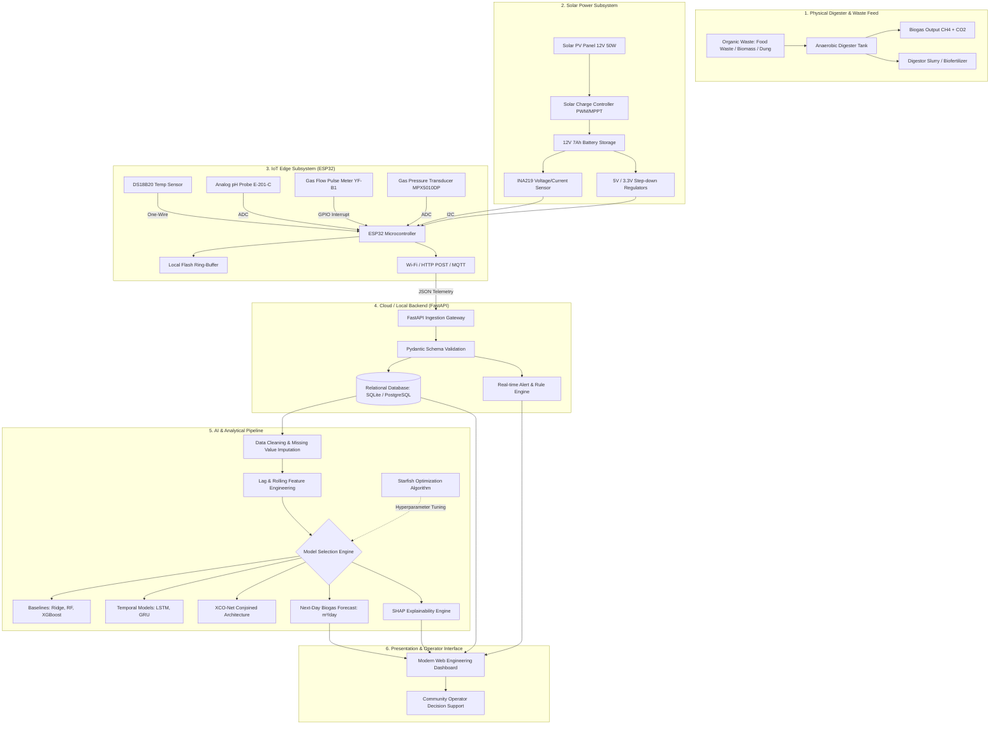

# SYSTEM ARCHITECTURE SPECIFICATION

**Project Title:** AI-Driven Solar-Biogas System for Sustainable Communities  
**Team:** Espada  
**Track:** IEEE YESIST12 Innovation Challenge (SDG 11)  
**Document Version:** 1.0 (Definitive Baseline)  
**Date:** September 14, 2026  

---

## 1. System Overview & Architectural Topology

The platform provides an end-to-end, IoT-connected, AI-driven monitoring and decision-support solution for small/community-scale anaerobic digestion systems. The design couples low-power embedded electronics, renewable solar power, a resilient backend API, state-of-the-art machine learning forecasting, and transparent explainability.

---

## 2. Subsystem Technical Specifications

### 2.1 Physical Anaerobic Digester & Safety Subsystem
- **Capacity:** Small community-scale prototype (e.g., $100–500\text{ L}$ reactor volume, expandable to $2–5\text{ m}^3$).
- **Substrates:** Segregated community food waste, vegetable market peels, cow dung inoculum.
- **Biokinetic Regime:** Mesophilic operation ($35^\circ\text{C} \pm 3^\circ\text{C}$), optimal pH $7.2 – 7.8$.
- **Safety Boundary:** Passive mechanical overpressure relief valve (set to $1.2\text{ bar}$) and manual emergency flame arrestor.
- **Safety Rule:** No automated actuators control hazardous gas releases or high-pressure compressors. All physical valves are human-supervised.

### 2.2 Solar Energy Subsystem
- **Function:** Power the IoT sensors, microcontroller, and local telemetry without grid reliance.
- **Solar Module:** 12V, 50W Monocrystalline PV Panel.
- **Charge Controller:** 12V 10A PWM or MPPT Solar Controller with low-voltage disconnect.
- **Battery Storage:** 12V 7Ah Sealed Lead-Acid (SLA) or LiFePO4 battery pack, yielding 24+ hours of system autonomy.
- **Power Telemetry:** INA219 high-side DC current and voltage sensor on the $I^2C$ bus monitoring panel input and battery state-of-charge (SoC).

### 2.3 IoT Edge Architecture (ESP32)
- **Processor:** ESP32-WROOM-32 (Dual-core 240MHz, 520KB SRAM, 4MB Flash).
- **Sensor Interfaces:**
  - **Temperature:** Dallas DS18B20 digital temperature probe inside thermal well ($\pm 0.5^\circ\text{C}$ precision).
  - **pH:** E-201-C combination glass electrode with analog signal conditioning amplifier.
  - **Biogas Flow:** Hall-effect pulse flowmeter calibrated for methane/biogas density.
  - **Biogas Pressure:** MPX5010DP differential/gauge analog pressure transducer ($0–10\text{ kPa}$).
- **Resilience Mechanisms:**
  - **Local Ring Buffering:** If Wi-Fi is lost, up to 1,000 readings are buffered in non-volatile flash (SPIFFS/LittleFS) and retransmitted upon reconnection.
  - **Heartbeat & Liveness:** Device transmits periodic keep-alives; the backend flags `OFFLINE` if no packet is received for $> 3\times$ sampling period.
  - **Null Safety:** Missing or faulty sensor readings transmit as `null` rather than dummy zero values.

### 2.4 Backend API & Database (FastAPI + SQLAlchemy)
- **Language:** Python 3.11 / 3.13.
- **Framework:** FastAPI with Uvicorn ASGI server.
- **Database Engine:** SQLAlchemy ORM supporting SQLite (default local zero-configuration) and PostgreSQL (production).
- **Core Entities:**
  1. `devices`: Physical/virtual digester monitoring units.
  2. `sensor_readings`: Chronological telemetry time-series (temp, pH, flow, pressure, source).
  3. `forecast_results`: Model forecasts ($y_{t+1}$), timestamps, model IDs, confidence intervals.
  4. `model_runs`: Model training metadata, dataset versions, hyperparameter configs.
  5. `model_metrics`: Evaluation scores (MAE, RMSE, $R^2$, NNSE).
  6. `alerts`: Active and acknowledged system events with severity levels.
  7. `solar_metrics`: Voltage, current, power, and battery charge states.

### 2.5 Machine Learning & Forecasting Architecture
- **Problem Formulation:** Multi-variate single-step time-series forecasting:
  $$\hat{y}_{t+1} = f(X_t, X_{t-1}, \dots, X_{t-k}; \Theta)$$
  where $y_{t+1}$ is next-day biogas production ($m^3/day$).
- **Features:** Feed mass, substrate proportions, pH, temperature, agitator runtime, lagged gas output, 3-day and 7-day rolling statistics.
- **Models Implemented:**
  1. *Persistence Baseline:* $\hat{y}_{t+1} = y_t$
  2. *Tabular Baselines:* Ridge Regression, Random Forest, XGBoost
  3. *Recurrent Sequence Models:* PyTorch LSTM, PyTorch GRU
  4. *XCO-Net:* Proposed conjoined dual-branch network with operational and feedstock encoders.
  5. *Starfish Optimization Algorithm:* Metaheuristic hyperparameter optimization.
- **Data Leakage Safeguard:** Strictly chronological splitting ($70\%$ train, $15\%$ validation, $15\%$ test). Scalers fit strictly on training set.

### 2.6 Explainable AI & Decision Support
- **Engine:** SHAP (SHapley Additive exPlanations) TreeExplainer and DeepExplainer.
- **Operator Output:** Real-time decomposition:
  $$\hat{y}_{t+1} = \phi_0 + \sum_{i=1}^M \phi_i(x_t)$$
  Translates math into plain-language advice (e.g. *"Predicted gas drop of 18% primarily driven by recent temperature drop (-1.8°C) and acidic feed (pH 5.9). Recommendation: Check slurry heater and reduce citrus/acidic waste loading."*).

### 2.7 Frontend Web Engineering Dashboard
- **Framework:** React 18 / Vite modern SPA.
- **Key Modules:**
  - System Status Ribbon (Device Status, Uptime, Mode Badge).
  - Mode Indicator: High-visibility badge distinguishing `MODE: DEMO (SYNTHETIC)` vs `MODE: LIVE (ESP32/RESEARCH)`.
  - Dynamic Time-Series Telemetry Charts (Temperature, pH, Flow, Pressure).
  - Forecast Comparison (Actual vs Predicted, Residuals, Uncertainty bounds).
  - Explainability Waterfall Panel (SHAP values).
  - Solar Power & Battery Health Gauges.
  - Active Alert Center with acknowledgment workflows.

---

## 3. Operational Mode Separation

The system strictly isolates data sources to maintain scientific integrity:

| Aspect | `DEMO MODE` | `LIVE MODE` |
|---|---|---|
| **Data Origin** | Physics-based synthetic generator (`generate_dataset.py`) or historical research playback | Physical ESP32 hardware via HTTP/MQTT or live industrial link |
| **Telemetry Source Tag** | `source = "synthetic"` or `source = "research_spark"` | `source = "live_esp32"` |
| **Badge Styling** | Amber background: `DEMO MODE (SYNTHETIC)` | Green background: `LIVE MODE (HARDWARE)` |
| **Evaluation Reporting** | Tagged as illustrative demo performance | Tagged as empirical real-world validation |
