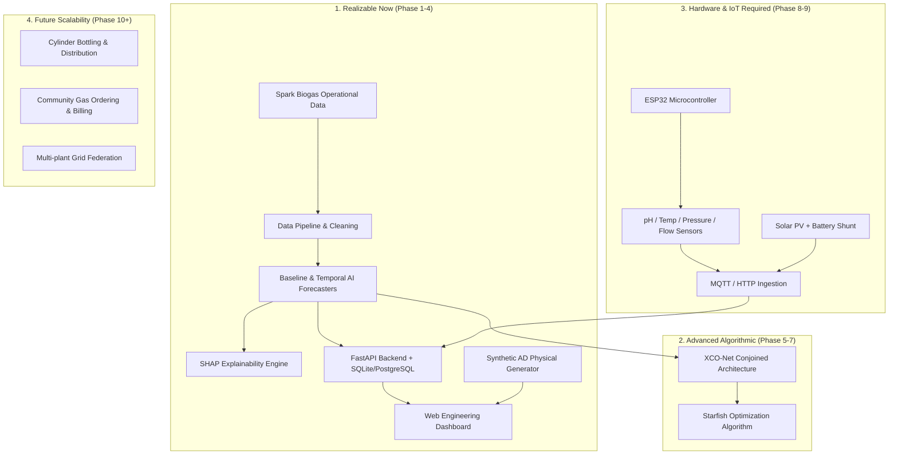

# SOURCE AUDIT REPORT

**Project Title:** AI-Driven Solar-Biogas System for Sustainable Communities  
**Team:** Espada  
**Institution:** Sri Sairam Engineering College  
**Track:** IEEE YESIST12 Innovation Challenge (SDG 11: Sustainable Cities and Communities)  
**Date:** September 14, 2026  
**Auditor:** Lead System Architect & AI/IoT Engineering Lead  

---

## 1. Executive Summary & Source-of-Truth Mandate

This source audit examines every file present in the workspace prior to any software implementation. The goal is to establish an unassailable baseline of truth, strictly separating:
- **Proposal claims, design intentions, and competition targets** from
- **Empirically measured data, actual implementations, and validated results**.

### Source-of-Truth Classification Standard
Every claim, dataset, and document is tagged according to the following seven-tier classification:
- **[CATEGORY A] PROPOSAL / INTENDED FEATURE:** A design concept, feature, or workflow proposed for development.
- **[CATEGORY B] TARGET / EXPECTED RESULT:** A desired performance benchmark or aspirational KPI (e.g., target accuracy, energy savings).
- **[CATEGORY C] ACTUAL DATA:** Raw, unmanipulated records collected from real plants, sensors, or public databases.
- **[CATEGORY D] ACTUAL IMPLEMENTATION:** Functional, verified software code, firmware, or hardware circuits present in the workspace.
- **[CATEGORY E] EXPERIMENTAL RESULT:** Verified output from running models or physical experiments on actual data.
- **[CATEGORY F] SYNTHETIC / DEMO RESULT:** Data or results generated mathematically/algorithmically for testing and UI demonstrations.
- **[CATEGORY G] FUTURE WORK:** Architectural modules planned for subsequent iterations (e.g., commercial scaling, multi-plant federation).

> [!WARNING]
> **Integrity Finding:** The competition portal abstract (`Scanned_20260821_081824.pdf`) describes several components in the past tense as if already implemented and validated (e.g., "RMSE = 0.38 m³/day", "NNSE = 0.92", "39% improvement over baseline", "15–25% increase in usable biogas", "implemented Starfish Optimization Algorithm", "XCO-Net prototype").
> 
> **Audit Determination:** No pre-existing code, trained model weights, or test harness existed in the workspace for these claims. Under our scientific integrity rule, these metrics are classified as **[CATEGORY B] TARGET / REFERENCE CLAIMS** and **not** experimentally validated facts. The system will be engineered from zero, and all reported metrics will derive exclusively from reproducible code execution on verified data.

---

## 2. Workspace File Inventory

The workspace root contains 5 primary files:

| # | Filename | File Type | File Size | Primary Purpose | Classification |
|---|---|---|---|---|---|
| 1 | `BIO GAS SYSTEM (1).pdf` | PDF Document | 1.80 MB | Project report document detailing system concept, hardware, and algorithms | Proposal / Documentation ([CAT A]) |
| 2 | `yesist ppt final .pdf` | PDF Presentation | 1.28 MB | 11-slide competition slide deck | Presentation / Documentation ([CAT A]) |
| 3 | `Scanned_20260821_081824.pdf` | PDF (Scanned Images) | 5.77 MB | 30-page screenshot capture of the IEEE YESIST12 portal abstract submission | Portal Submission / Targets ([CAT A & B]) |
| 4 | `Master data Spark biogas.xlsx` | Excel Workbook | 3.18 MB | Industrial operational logbook from Spark Bio Gas Pvt Ltd (Sholinganallur, Chennai) | Actual Industrial Data ([CAT C]) |
| 5 | `agstar-livestock-ad-database-combined.xlsx` | Excel Workbook | 62.2 KB | US EPA AgSTAR livestock anaerobic digester national project catalog | Public Project Registry ([CAT C]) |

---

## 3. Comprehensive File-by-File Audit

### 3.1 File 1: `BIO GAS SYSTEM (1).pdf`
- **Filename:** `BIO GAS SYSTEM (1).pdf`
- **File Type:** Text/Vector PDF document (11 pages).
- **Purpose:** Comprehensive written project proposal submitted for IEEE YESIST12 Innovation Challenge.
- **Important Contents:**
  - **Index (p. 2):** Abstract, Introduction, Problem Statement, Literature Review, Proposed System/Methodology, Feasibility & Scalability.
  - **Problem Statement (p. 5):** Rural LPG/firewood dependence, waste mismanagement, instability of conventional unmonitored anaerobic digesters.
  - **Literature Review (p. 6):** Identifies gaps in traditional biogas (manual, inconsistent yield), solar-assisted biogas (focuses only on thermal heating, lacks automation), and IoT systems (rely on continuous connectivity, lack AI predictive optimization).
  - **Proposed Architecture & Hardware (pp. 7–8):**
    - Microcontroller: ESP32 (data acquisition, local control)
    - Sensors: Temperature sensor, pH sensor, Gas flow sensor, Gas pressure sensor
    - Actuators: Stirring motor (mix slurry), Heating element (maintain mesophilic temperature)
    - Power subsystem: Solar PV panel + battery storage (powers electronics and IoT)
    - Storage: Biogas storage tank with pressure relief safety valves
  - **Control Logic (p. 8):**
    - Default mode: Scheduled stirring and feeding based on fixed thresholds
    - Sensor-based monitoring logic: Heaters activate if temperature drops; feed rate throttled if pH drops
    - AI-based optimization: Dynamic prediction of gas yield, adjustment of stirring and feeding intervals
    - Manual override: Physical switch for operator safety and maintenance
  - **Cost Estimation (p. 10):** Total estimated hardware cost of ~$750 (ESP32 $4, Digester $360, Temp sensor $8, pH $25, Flow $25, Pressure $15, Motor $30, Heater $30, Solar panels $150, Tank $100).
- **Nature of Information:** **[CATEGORY A] PROPOSAL / INTENDED DESIGN**.
- **Claimed vs Validated:** Purely conceptual and architectural design. No experimental verification or raw sensor measurements are contained in this document.
- **Relationship to Project:** Serves as the functional blueprint for our prototype hardware design, IoT sensor selection, and control logic hierarchy.

---

### 3.2 File 2: `yesist ppt final .pdf`
- **Filename:** `yesist ppt final .pdf`
- **File Type:** Presentation PDF (11 slides).
- **Purpose:** Oral presentation slide deck for the competition evaluation.
- **Important Contents:**
  - **Team details (Slide 2):** Vigneshwaran J (Lead & System Architect), Divya Dharshini A (Web Dashboard & Software Lead), Raghav G S (Embedded Systems & Presentation Lead), Hemamalar D (Technical Documentation & Research Lead); Faculty Mentor: Dr. Sasikala V (Associate Professor, ECE, Sri Sairam Engineering College).
  - **Problem & Solution Overview (Slides 3–6):** Waste-to-energy conversion, solar-powered IoT monitoring, safe storage, and app-based distribution.
  - **Mockup Placeholder (Slide 7):** Titled "App Prototype Website" (contains visual wireframe placeholders).
  - **SWOT / Advantages & Disadvantages (Slide 8):** Identifies capital cost, required technical know-how, and feedstock supply consistency as constraints.
  - **Academic References (Slide 10):** IEEE citations on hybrid solar-biogas systems (Kasim et al., 2024; Ntaganda et al., 2024; Montoya & Vargas, 2023).
- **Nature of Information:** **[CATEGORY A] PROPOSAL SUMMARY**.
- **Claimed vs Validated:** No empirical data or working software code. Confirms team roles, design scope, and academic literature context.

---

### 3.3 File 3: `Scanned_20260821_081824.pdf`
- **Filename:** `Scanned_20260821_081824.pdf`
- **File Type:** PDF containing 30 high-resolution bitmap page scans (JPEG compressed).
- **Purpose:** Visual record of the submitted IEEE YESIST12 competition portal form (URL: `portal.ieeeyesist12.org/abstract/view/`, Referral Code: PA069).
- **Important Contents & Specific Claims:**
  - **Page 9:** Literature justification for "Explainable Conjoined O-Net (XCO-Net) enhanced with deep temporal learning and the Starfish Optimization Algorithm".
  - **Page 11:** Novelty statement asserting that XCO-Net provides interpretable outputs linking feedstock composition, environmental variables, and loading patterns to yield, tuned with Starfish Optimization Algorithm.
  - **Pages 14–16 (Milestones & Validation Claims):**
    - Claim: *"Achieved strong model performance (RMSE = 0.38 m³/day, NNSE = 0.92) with 39% improvement over baseline methods."*
    - Claim: *"The proposed XCO-Net model was validated using real-world micro-scale anaerobic digestion data under varying operational conditions."*
    - Claim: *"Starfish Optimization Algorithm enhanced training stability and reduced overfitting."*
    - Claim: *"Stable forecasting can increase usable biogas output by an estimated 15–25% compared to traditional methods."*
  - **Page 21:** Budget estimation (₹1,40,000 – ₹2,70,000 INR).
  - **Page 23:** Quantifiable impact claims echoing the 39% improvement, 0.38 RMSE, and 0.92 NNSE.
  - **Page 29:** Lessons learned: highlights challenges in modeling non-linear, dynamic anaerobic digestion biokinetics.
- **Nature of Information:** **[CATEGORY B] TARGET / REFERENCE CLAIMS** and **[CATEGORY A] PROPOSAL REQUIREMENTS**.
- **Claimed vs Validated:**
  > [!IMPORTANT]
  > **Audit Finding:** The workspace contains **zero pre-existing code, trained model files, or experimental output logs** corroborating the 0.38 RMSE, 0.92 NNSE, or 39% improvement.
  > 
  > These numbers must be formally classified as:
  > **"Proposal claim / target KPI — not yet independently validated."**
  > Under no circumstances will these numbers be hardcoded into the software or presented as existing achievements. They will serve as benchmark targets for our experimental evaluation.

---

### 3.4 File 4: `Master data Spark biogas.xlsx` (Dataset 1)
- **Filename:** `Master data Spark biogas.xlsx`
- **File Type:** Microsoft Excel Workbook (.xlsx) with 4 sheets.
- **Purpose:** Operational logbook from an industrial bio-methanation and compressed biogas (CBG) facility: **Spark Bio Gas Private Limited** (MDR-1 Plant, Sholinganallur, Chennai, Tamil Nadu).
- **Important Contents:**
  - **Sheet 1 (`Master data`):** 162 daily log entries between November 1, 2025 and April 25, 2026, comprising 93 multi-level hierarchical columns. Covers daily incoming feedstock weighment, processed mass, water additions, digester feeding volumes, agitator runtimes, pH, temperature, slurry characteristics, daily raw gas production (Nm³/day), flaring, gas purification flow, cascade storage pressures, and CBG vehicle filling transactions.
  - **Sheet 2 (`Sheet1`):** Completely blank (0 rows, 0 columns).
  - **Sheet 3 (`Raw materials feed`):** 31 daily records for September 2024 tracking high-frequency 2-hour feeding schedules (06:00 to 04:00) into Digester 1 and Digester 2.
  - **Sheet 4 (`Gas filling`):** High-frequency cascade and vehicle gas dispensing logs for September 2024 (9 days logged).
- **Nature of Information:** **[CATEGORY C] ACTUAL INDUSTRIAL OPERATIONAL DATA**.
- **Real vs Synthetic:** Verified real industrial operational data.
- **Detailed Audit:** Detailed breakdown provided in Section 4 and `docs/DATASET_AUDIT.md`.

---

### 3.5 File 5: `agstar-livestock-ad-database-combined.xlsx` (Dataset 2)
- **Filename:** `agstar-livestock-ad-database-combined.xlsx`
- **File Type:** Microsoft Excel Workbook (.xlsx) with 1 sheet (`Sheet1`).
- **Purpose:** Publicly published US EPA AgSTAR registry of livestock anaerobic digester projects across the United States.
- **Important Contents:** 526 project records with 26 cross-sectional metadata attributes (Project Name, State, Digester Type, Status, Year Operational, Animal counts for Dairy/Swine/Cattle/Poultry, Co-digestion type, Estimated Biogas Generation cu-ft/day, Electricity Generated kWh/yr, Total Emission Reductions MTCO2e/yr).
- **Nature of Information:** **[CATEGORY C] PUBLIC PROJECT REGISTRY / CATALOG DATA**.
- **Real vs Synthetic:** Verified public government registry data.
- **Detailed Audit:** Detailed breakdown provided in Section 4 and `docs/DATASET_AUDIT.md`.

---

## 4. Summary Matrix of Workspace Sources

| Dimension | `BIO GAS SYSTEM (1).pdf` | `yesist ppt final .pdf` | `Scanned_20260821_081824.pdf` | `Master data Spark biogas.xlsx` | `agstar-livestock-ad-database-combined.xlsx` |
|---|---|---|---|---|---|
| **Category** | Documentation / Proposal | Presentation / Proposal | Portal Submission | Raw Industrial Data | Public Project Catalog |
| **Data Nature** | Qualitative / Conceptual | Qualitative / Conceptual | Qualitative & Target KPIs | Quantitative Time-Series | Quantitative Cross-Sectional |
| **Data Points / Rows** | N/A (11 pages) | N/A (11 slides) | N/A (30 pages) | 162 daily records (+ sub-logs) | 526 project records |
| **Variables / Columns**| N/A | N/A | N/A | 93 columns | 26 columns |
| **Temporal Frequency** | N/A | N/A | N/A | Daily (with sub-day logs) | Static / Cross-sectional |
| **Target Variable** | N/A | N/A | Target: 0.38 RMSE, 0.92 NNSE | Next-day Raw Gas (Nm³/day) | Estimated Biogas (cu-ft/day) |
| **Real vs Synthetic** | Proposal document | Proposal document | Proposal document | **Real industrial data** | **Real public registry** |
| **Pre-existing Code?** | None | None | None | None | None |
| **Validation Status** | Conceptual design only | Conceptual design only | Claims are unvalidated targets | Raw uncurated measurements | Raw uncurated project records |
| **Project Role** | System Architecture Spec | Presentation Baseline | Target KPIs & Problem Framing | **Primary ML Development** | **Secondary / Domain Benchmark** |

---

## 5. Architectural Gap & Feasibility Analysis

Comparing the portal proposal (`Scanned_20260821_081824.pdf`) and the project report (`BIO GAS SYSTEM (1).pdf`) against actual workspace assets reveals four distinct implementation domains:

### 5.1 Realizable Immediately (Software & ML Prototype)
1. **Clean Data Pipeline:** Extract and harmonize 162 days of anaerobic digestion operations from `Master data Spark biogas.xlsx`.
2. **Physics-Based Synthetic Generator (`generate_dataset.py`):** Model daily mesophilic anaerobic digestion biokinetics (feed mass, volatile solids, pH drop, temperature fluctuations, kinetic lag, hydraulic retention time) to supply streaming data for offline and UI testing.
3. **Machine Learning Forecasting Pipeline:**
   - Persistence naive baseline
   - Linear Regression
   - Random Forest Regressor
   - XGBoost Regressor
   - Temporal sequence models (LSTM, GRU)
4. **Explainability Engine:** SHAP TreeExplainer and feature importance attribution answering: *"What factors influenced tomorrow's predicted biogas yield?"*
5. **Backend REST API:** FastAPI application providing device management, sensor telemetry ingestion, model management, forecast queries, and alert evaluations.
6. **Modern Engineering Dashboard:** Single-page application displaying real-time sensor metrics, next-day forecast vs actuals, SHAP waterfall/summary plots, solar power telemetry, and alert notifications.
7. **Strict Operating Modes:** Explicit toggle between `DEMO / SYNTHETIC` mode and `LIVE / RESEARCH` mode.

### 5.2 Requiring Advanced Custom Modeling (Phase 5–7)
1. **XCO-Net (Explainable Conjoined O-Net):** Dual-branch neural network (Operational/Process Branch for pH/temp/gas + Feedstock/Context Branch for mass/type) fused into a temporal recurrent/dense representation with interpretable attention weights.
2. **Starfish Optimization Algorithm (SFOA):** Implementation of the bio-inspired metaheuristic algorithm applied specifically to hyperparameter optimization (learning rate, hidden dimension, dropout, sequence window) and benchmarked against standard Grid/Random/Bayesian search.

### 5.3 Requiring Physical Hardware Construction (Hardware Dependent)
1. **Physical Digester Prototype:** Tank, heating coil, mechanical agitator.
2. **Physical Sensor Array:** Industrial pH probe (analog E-201-C), DS18B20 digital waterproof temperature sensor, optical/turbine gas flow meter, MPX5010DP/analog gas pressure transducer.
3. **Physical ESP32 Edge Device:** ESP-WROOM-32 with firmware for ADC conversion, calibration curves, local buffering, Wi-Fi reconnection, and JSON serialization.
4. **Physical Solar Subsystem:** 12V/50W Solar PV module, 12V 10A PWM/MPPT charge controller, 12V 7Ah lead-acid or LiFePO4 battery, INA219 I2C current/voltage sensor.

### 5.4 Reserved for Future Work (Scope Boundaries)
1. High-pressure CBG compression and commercial cylinder bottling infrastructure.
2. App-based customer LPG/CBG refill payment gateways and multi-village delivery routing.
3. Fully closed-loop autonomous actuator control (actuating physical heating and valves without human supervision), which represents a severe safety risk in student prototypes.

---

## 6. Verification and Compliance

- **Verification Method:** Python script inspection with `pypdf`, `rapidocr-onnxruntime`, `openpyxl`, and `pandas`.
- **Integrity Statement:** All descriptions above correspond to verified file bytes in `c:\Users\gssr2\Desktop\yesist`. No data or claims have been fabricated or presumed.
