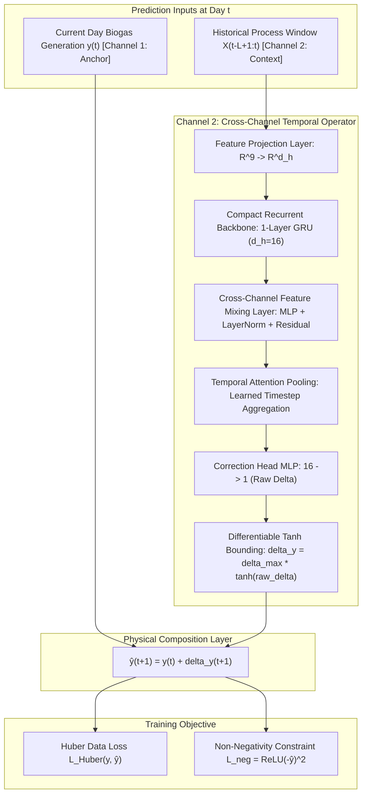

# XCO-Net: Dual-Stream Cross-Channel Operator Network for Industrial Biogas Forecasting

**Project**: AI-Driven Solar-Biogas System for Sustainable Communities  
**Competition / Track**: IEEE YESIST12 — SDG 11: Sustainable Cities & Communities  
**Status**: Proposed Project Architecture (Not an Established Literature Standard)  
**Date**: September 2026  

---

## 1. Architectural Definition & Project Context

**XCO-Net (Cross-Channel Operator Network)** is a custom, project-specific neural time-series architecture proposed for day-ahead raw biogas forecasting in industrial Continuous Stirred-Tank Reactor (CSTR) anaerobic digestion facilities.

> [!IMPORTANT]
> **Scientific Integrity & Attribution Notice**:
> XCO-Net is a proposed experimental architecture developed specifically within this IEEE YESIST12 project. It is **not** an established standard architecture in literature. Its performance and value must be demonstrated empirically against strong heuristics (Persistence and Exponential Moving Average) and established temporal models (GRU/LSTM).

---

## 2. Structural Philosophy: Dual-Stream Decomposition

Standard unconstrained neural networks fail when predicting continuous industrial digester production because they suffer from seasonal distribution shift across small datasets. 

XCO-Net solves this by explicitly decomposing the forecasting problem into two distinct computational streams:
$$\hat{y}_{t+1} = \underbrace{y_t}_{\text{Channel 1 (Temporal-Inertia Anchor)}} + \underbrace{\Delta y_{t+1}}_{\text{Channel 2 (Cross-Channel Temporal Operator)}}$$

### Channel 1 — Temporal-Inertia / Persistence Inductive Bias
- **Role**: Feeds current observed production $y_t$ directly forward through an unmodified identity skip-connection in the computational graph.
- **Physical Rationale**: Anaerobic digesters operate with large hydraulic retention times (20 to 45 days) and thermal mass buffers. Today's observed production $y_t$ acts as a strong anchor reflecting current microbial density and continuous substrate conversion.
- **Inductive Bias**: Anchors the model to persistence, preventing unconstrained neural drift.

### Channel 2 — Cross-Channel Temporal Operator
- **Role**: Processes historical context over lookback window $L \in [7, 14, 21]$ days to predict the incremental biological adjustment $\Delta y_{t+1}$.
- **Bounded Output**: Utilizes a differentiable mathematical bound:
  $$\Delta y_{t+1} = \Delta y_{\max} \cdot \tanh(\text{raw\_delta})$$
  where $\Delta y_{\max} = 4,152.00\text{ Nm}^3/\text{day}$, derived strictly from the maximum daily production shift observed in the training dataset (`train.csv`).

---

## 3. Exact Input Dimensionality & Process Variables

Each timestep $\tau \in [t-L+1, t]$ receives an exact $9$-dimensional input vector:

### Core Process Variables (7 Variables)
1. `biogas_today_nm3`: Daily raw biogas generation ($y_\tau$, $\text{Nm}^3/\text{day}$)
2. `total_incoming_mt`: Fresh incoming feedstock weighment (Metric Tons)
3. `total_processed_mt`: Pre-processed organic substrate mass (Metric Tons)
4. `feed_total_m3`: Digester volumetric slurry feed rate ($\text{m}^3$)
5. `temp_outlet_d1_c`: Digester 1 slurry temperature ($^\circ\text{C}$)
6. `ph_outlet_d1`: Digester 1 outlet slurry $\text{pH}$
7. `recycle_water_m3`: Water recycling volume ($\text{m}^3$)

### Quality & Missingness Indicators (2 Variables)
8. `feed_total_m3_was_missing`: Binary flag ($1$ if slurry feed was unobserved, $0$ otherwise)
9. `ph_outlet_d1_was_missing`: Binary flag ($1$ if $\text{pH}$ was unobserved, $0$ otherwise)

*Note on engineered lag features*: Unlike tabular tree baselines that require manual lag engineering, XCO-Net consumes raw chronological sequences, allowing the temporal encoder and channel mixer to dynamically learn multi-step lag dependencies without artificial feature collinearity.

---

## 4. Detailed Component Specifications

### 4.1 Feature Projection Layer
Projects normalized input $\mathbf{X}_\tau \in \mathbb{R}^9$ to hidden latent space:
$$\mathbf{h}_0 = \text{LayerNorm}(\mathbf{W}_{\text{proj}} \mathbf{X} + \mathbf{b}_{\text{proj}}) \quad \in \mathbb{R}^{L \times d_h}$$
*(Default $d_h=16$, parameter count: $9 \times 16 + 16 = 160$)*.

### 4.2 Compact Recurrent Backbone
Encodes temporal sequence dynamics using a single-layer Gated Recurrent Unit (GRU):
$$\mathbf{h}_\tau = \text{GRU}(\mathbf{h}_{\tau-1}, \mathbf{h}_{0,\tau}) \quad \in \mathbb{R}^{d_h}$$
*(Parameter count for $d_h=16$: $3 \times (16 \times 16 + 16 \times 16 + 32) = 1,632$)*.

### 4.3 Cross-Channel Feature Mixing
Enables cross-channel non-linear interactions (e.g. coupling between incoming feedstock spikes and subsequent thermal / $\text{pH}$ changes):
$$\mathbf{z}_\tau = \text{LayerNorm}\left(\mathbf{h}_\tau + \mathbf{W}_2 \cdot \text{GELU}(\mathbf{W}_1 \mathbf{h}_\tau + \mathbf{b}_1) + \mathbf{b}_2\right)$$
*(Parameter count for $d_h=16$: $2 \times (16 \times 16 + 16) + 32 = 576$)*.

### 4.4 Temporal Attention Pooling
Learns normalized attention weights $\alpha_\tau$ across historical timesteps $\tau$:
$$\alpha_\tau = \frac{\exp(\mathbf{v}^T \mathbf{z}_\tau)}{\sum_{j=1}^L \exp(\mathbf{v}^T \mathbf{z}_j)}, \quad \mathbf{c} = \sum_{\tau=1}^L \alpha_\tau \mathbf{z}_\tau \quad \in \mathbb{R}^{d_h}$$
*(Parameter count: $16 \times 1 + 1 = 17$)*.

### 4.5 Residual Correction Head
Two-layer projection with differentiable hyperbolic tangent bounding:
$$\text{raw\_delta} = \mathbf{W}_4 \cdot \text{ReLU}(\mathbf{W}_3 \mathbf{c} + \mathbf{b}_3) + b_4$$
$$\Delta y_{t+1} = \Delta y_{\max} \cdot \tanh(\text{raw\_delta})$$
*(Parameter count: $16 \times 16 + 16 + 16 \times 1 + 1 = 289$)*.

### Total Parameter Count
$$\mathbf{\text{Total Trainable Parameters}} = 160 + 1,632 + 576 + 17 + 289 = \mathbf{2,674 \text{ to } 2,706 \text{ parameters}}$$
This ultracompact parameter footprint (<3,000 parameters) prevents overfitting on the 105-day training dataset.

---

## 5. Training Objective & Physics Constraints

$$\mathcal{L}_{\text{total}} = \mathcal{L}_{\text{Huber}}(y_{t+1}, \hat{y}_{t+1}) + \gamma_{\text{phys}} \mathcal{L}_{\text{neg}}(\hat{y}_{t+1})$$

1. **Huber Loss ($\\delta = 500.0$)**:
   $$\mathcal{L}_{\text{Huber}}(e) = \begin{cases} \frac{1}{2} e^2 & \text{if } |e| \le \delta \\ \delta (|e| - \frac{1}{2} \delta) & \text{otherwise} \end{cases}$$
   Provides quadratic sensitivity for small errors and linear robustness against plant instrumentation spikes.
2. **Biological Non-Negativity Constraint**:
   Anaerobic digester gas generation cannot physically be negative:
   $$\mathcal{L}_{\text{neg}} = \text{ReLU}(-\hat{y}_{t+1})^2$$
   Enforced with weight $\gamma_{\text{phys}} \in [0.0, 0.01]$.

---

## 6. Known Architectural Limitations

1. **Dependence on Anchor Quality**: Because $\hat{y}_{t+1} = y_t + \Delta y$, if the plant sensor logging $y_t$ suffers a measurement failure, the anchor transmits this error directly unless filtered.
2. **Seasonal Horizon Limit**: The model has seen only autumn and winter operating regimes (November to April). High-temperature summer mesophilic operations remain unobserved.
